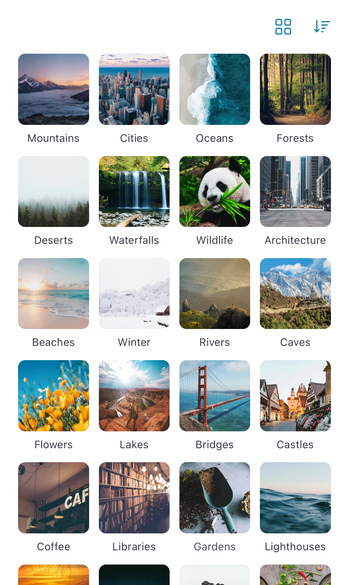
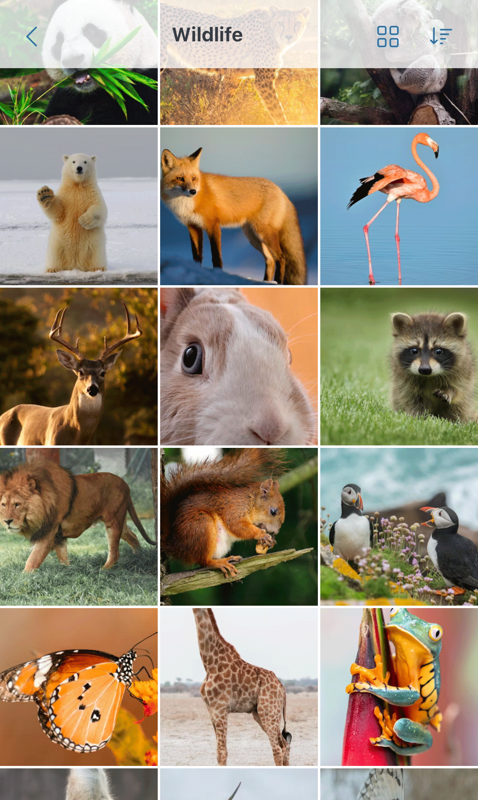

# Eagle WebUI

A web interface for the Eagle image viewer application

<table>
<tr>
<td width="50%">



</td>
<td width="50%">



</td>
</tr>
</table>

## Features

- Optimized for comfortable mobile image viewing
- Read-only viewer that won't modify your library, sync files, or consume storage
- Simple one-command setup
- Multi-language support - Available in English, Japanese, Chinese (Simplified & Traditional), Korean, Spanish, and German

## Requirements

Node.js >= 18.18.0

## Installation and Usage

Make sure Eagle app is running.

On the same machine, run the following command:

```bash
npx eagle-webui
```

Then open http://localhost:34917/ in your browser.

### Command-line Options

| Option            | Description                                                           |
| ----------------- | --------------------------------------------------------------------- |
| `--hostname`      | Bind server to a specific hostname or IP address (default: localhost) |
| `--port`          | Server port number (default: 34917)                                   |
| `--eagle-api-url` | Eagle API URL (default: http://localhost:41595)                       |

### Accessing from Other Devices

To access the interface from other devices on your network:

```bash
npx eagle-webui --hostname 0.0.0.0
```

**⚠️ Security Warning:** This application serves images without authentication. Do not expose it to public networks.
